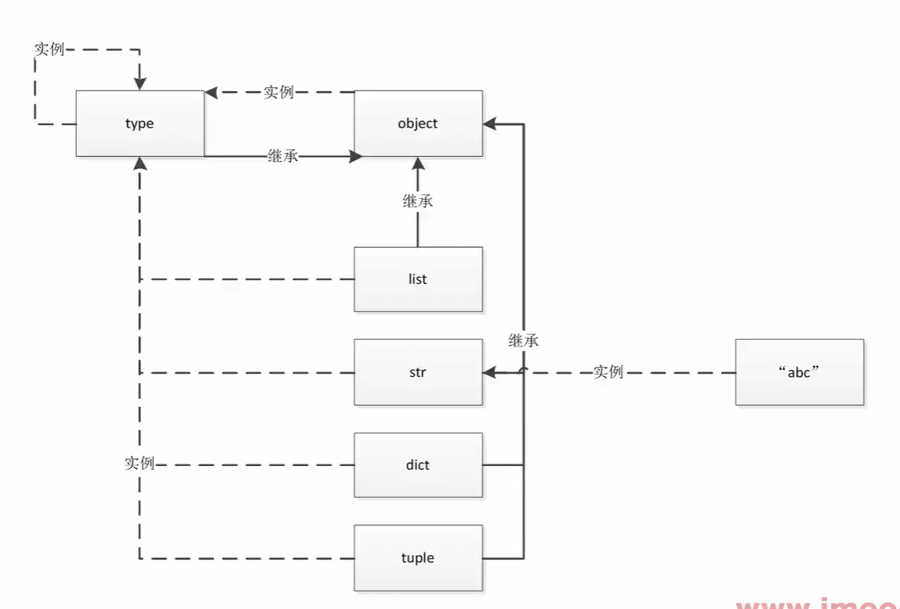

一张图：

1. 虚线代表是谁的实例化对象
2. 实线代表继承关系

搞清楚两件事情：

1. 继承自谁:一切都继承了 object
2. 自己是谁的实例化:比如 `list` 本身是一个类，但是它也是 type 的实例化对象; type 也是自身的实例对象; 

两个概念：

1. 继承：继承一个类
2. 类型：自己是谁的实例化，自己的类型不是继承的父类的类型，继承谁不代表自己就是谁的类型，这是两码事儿  ~ 

