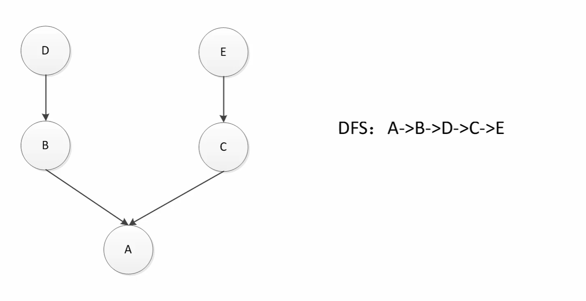
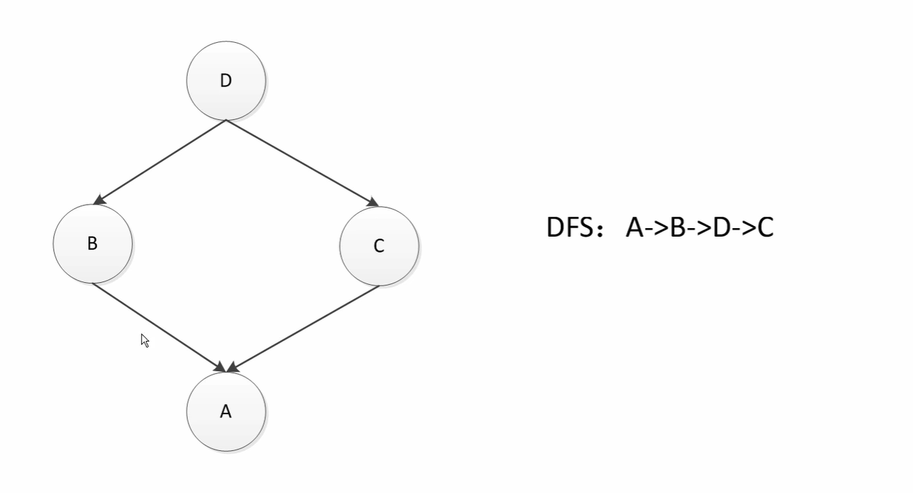
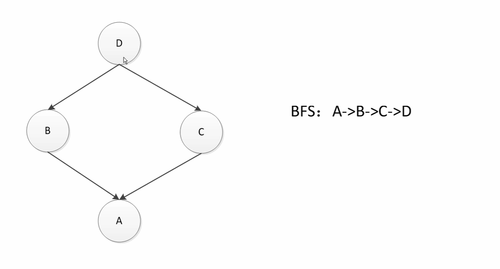
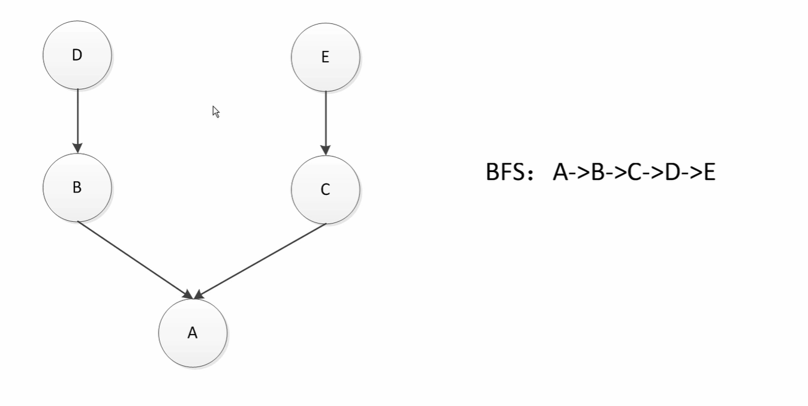

## MRO 

MRO 不是算法，只是说是一种查找顺序，但是这个查找顺序要用什么方式取决于具体的属性查找算法，例如 C3 算法

MRO : Method Resolution Order

MRO : 方法查询顺序 Python 使用的是 C3 的算法

`例子 1` 理解为 DFS 没有问题

`例子 2` 在菱形的情况下理解为 DFS 有问题

产生的问题：如果这种情况下使用 DFS 方式来进行属性查找，那么如果 C 覆盖了 D 中的方法，但是查找的时候 A 先查找了 B 然后直接查找了 D ，这样就起不到 C 中覆盖 D 中方法的效果了

`例子 3` 改为了 BFS 算法，在菱形的情况下没有问题

`例子 4` 这时候理解为 BFS 算法又出现了问题

B C D 都有同名的算法，A 中没有同名的算法，这时候会通过 A 先去查找 B 然后查找 C ， 但是按照继承的关系来看，应该是查找 A 后查找 B 再查找 D，因为 B 和 D 应该看作为一个整体