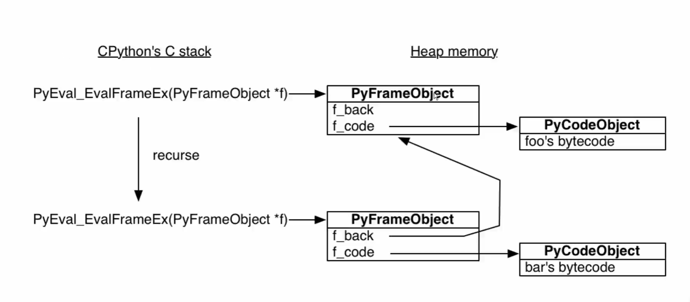
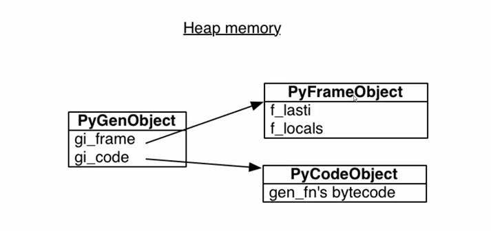

## 函数调用过程

`foo` 函数调用了 `bar` 函数:

栈帧对象 `PyFrameObject` 是分配在堆内存中的

在 CPython 的栈中创建了 `PyFrameObject`

靠上的 `PyFrameObject` 对象指向了它对应的 `foo` 函数的字节码对象 `PyCodeObject`

靠下的  `PyFrameObject` 对象指向了它对应的 `bar`  函数的字节码对象 `PyCodeObject`，其中 `f_back` 指向了调用者的 栈帧对象 `PyFrameObject`

我的理解：根据一切皆对象的思想来理解的话，字节码对象 `PyCodeObject` 应该会知道自己运行到了哪一行了，从而 栈帧对象 `PyFrameObject` 中的 `f_code` 只需要指向 字节码对象 `PyCodeObject` 即可，而并不需要知道字节码具体运行到了哪一行

## 生成器

生成器对象是对 `PyFrameObject` 和 `PyCodeObject` 的封装

不一样的是：

1. 字节码的指向放在了 `PyGenObject` 对象中，而不在 `PyFrameObject` 中
2. `PyFrameObject` 中的 `f_lasti` 指向了最后执行的一条 Python 字节码代码的位置，在生成器对象中每次遇到 `yield` 语句就会停下来
3. `PyFrameObject` 中的 `f_locals` 指向了局部变量 