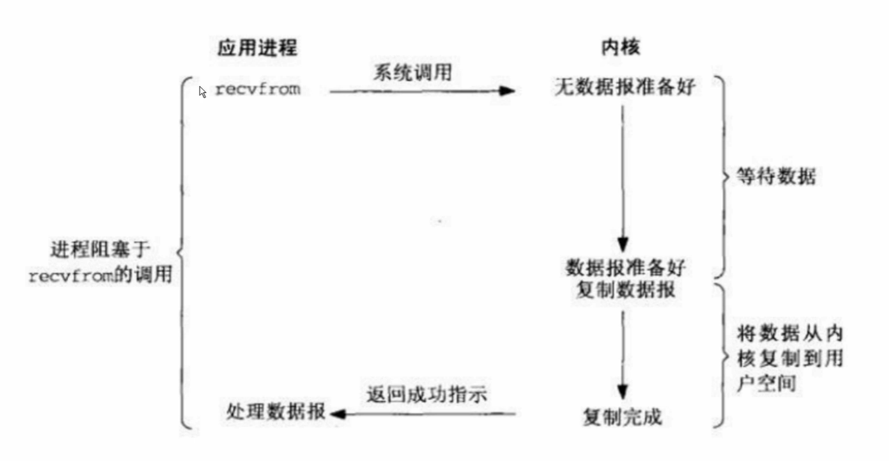
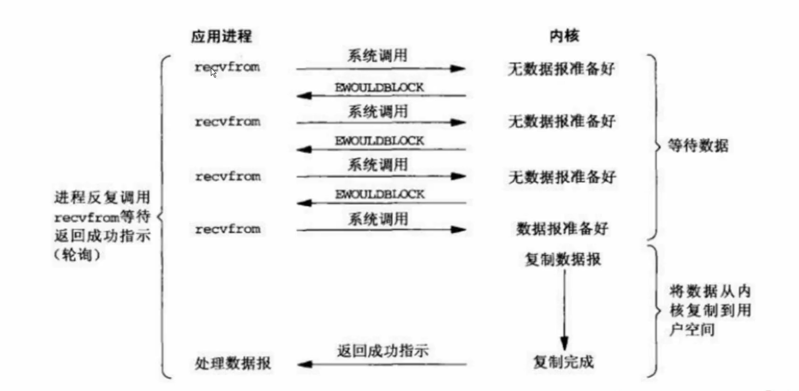
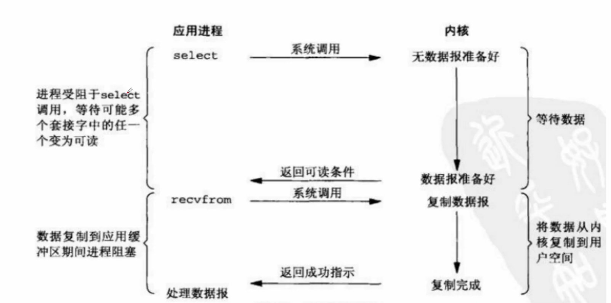
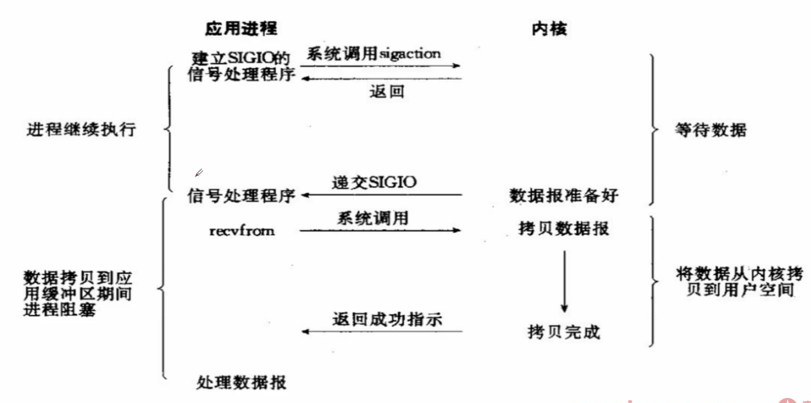
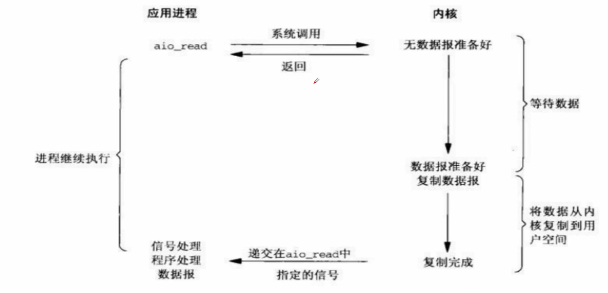

## C10K 问题

C10K 是一个在 1999 年被提出来的技术挑战

如何在一颗 1GHZ CPU，2G 内存，1Gbps 网络环境下，让单台服务器同时为 1 万个客户端提供 FTP 服务

开启 1w 个线程来服务 1w 个客户端是不现实的

## Unix 下个物种 IO 模型

从上到下是发展的关系：

1. 阻塞式 IO
2. 非阻塞式 IO
3. IO 多路复用
4. 信号驱动式 IO
5. 异步 IO （POSIX 的 aio_ 系列函数）

## 阻塞式 IO

例如： `client.connect((host, port))` 函数就是阻塞式 IO

## 非阻塞式 IO

`client.setblocking(False)` 切换为非阻塞式 IO

`clinet.connect((host, port))`

下一行代码依赖于上一行代码的情况：

虽然变成了非阻塞式 IO，但是，这并不代表网络建立完成了，这时候变成了循环等待的逻辑，这是非常消耗 CPU 的

下一行代码不依赖于上一行代码的情况：

这时候可以使用非阻塞式 IO，比如下边的代码是执行与上一行不相关的计算任务

非阻塞式 IO 的问题：

反复访问数据是否准备好也是一个耗时并且消耗 CPU 的过程

解决方案：

有没有一种方式，可以让操作系统准备好数据后通知应用程序来取，可以同时等待多个资源，监听多个资源是否准备好

我的理解：阻塞式 IO 是到取数据的代码后，线程卡在那里不动了，而刚提出的解决方案并不是让线程卡在那里不动，并且只能等待一个资源的到来

## IO 多路复用

`select` 发出获取数据的请求，`select` 也是一种阻塞式的方法，可以同时监听多个 `socket` ，而第二种方式的循环等待只能监听一个 `socket`

`recvfrom` 去执行获取数据的逻辑

但是 IO 多路复用还是有 把内核数据复制到用户空间的 过程时间

## 信号驱动式 IO

用的比较少

## 异步 IO

真正意义上的异步 IO，应用并不多，相比 IO 多路复用的性能提升并不多

少了一个中间的 `recvfrom` 的过程

是操作系统完全准备好数据并拷贝到用户空间后才会通知客户端程序

而若有 `recvfrom` 的过程，那么这个时候客户端程序需要在调用 `recvfrom` 函数后等待操作系统拷贝数据到用户空间的过程

实际上时间是一样的，但是对于客户端程序等待的时间长度是不一样的

## IO 多路复用：★

select , poll , epoll都是IO多路复用的机制。I/O多路复用就是通过一种机制，一个进程可以监视多个描述符，一旦某个描述符就绪(一般是读就绪或者写就绪），能够通知程序进行相应的读写操作。但select , poll , epoll本质上都是同步IO，因为他们都需要在读写事件就绪后自己负责进行读写，也就是说这个读写过程是阻塞的，而异步I/O则无需自己负责进行读写，异步I/O的实现会负责把数据从内核拷贝到用户空间。

本质上是同步IO，在读写事件就绪后自己负责读写，就是说，从内核空间读到用户空间，或者自己写数据到内核空间，并且读写过程中是阻塞的，而异步 IO 则把整个读写数据的过程交给了操作系统，待操作完成后才通知客户端程序

我的理解：同步 IO ==> 自己完成 IO 操作， 异步 IO ==> 委托给别的程序完成 IO 操作

`select`

select 函数监视的文件描述符分3类，分别是writefds、readfds、和exceptfds。调用后select函数会阻塞，直到有描述符就绪（有数据可读、可写、或者有except )，或者超时( timeout指定等待时间，如果立即返回设为null即可)，函数返回。当select函数返回后，可以通过遍历fdset，来找到就绪的描述符。
select目前几乎在所有的平台上支持，其良好跨平台支持也是它的一个优点。select的一个缺点在于单个进程能够监视的文件描述符的数量存在最大限制，在Linux上一般为1024，可以通过修改宏定义甚至重新编译内核的方式提升这一限制，但是这样也会造成效率的降低。select 被调用的时候会去遍历所有的 fds

writefds ==> write fds

readfds ==> read fds

exceptfds ==> except fds

`poll`

不同与select使用三个位图来表示三个fdset的方式，poll使用一个pollfd的指针实现。
pollfd结构包含了要监视的event和发生的event，不再使用select “参数-值”传递的方式。同时，pollfd并没有最大数量限制（但是数量过大后性能也是会下降)。和select函数一样，poll返回后，需要轮询pollfd来获取就绪的描述符。
从上面看，select和poll都需要在返回后，通过遍历文件描述符来获取已经就绪的socket。事实上，同时连接的大量客户端在一时刻可能只有很少的处于就绪状态，因此随着监视的描述符数量的增长，其效率也会线性下降

`epoll` e 可能是 extend 

epoll是在2.6内核中提出的，是之前的select和poll的增强版本。相对于select和poll来说，epoll更加灵活，没有描述符限制。epoll使用一个文件描述符管理多个描述符，将用户关系的文件描述符的事件存放到内核的一个事件表中，这样在用户空间和内核空间的copy只需一次。

ps: `epoll` 并不代表比 `select` 要好，在高并发并且连接活跃度不是很高的情况下， `epoll` 比 `select` 要好；并发性不高，同时连接很活跃的情况下，`select` 要比 `epoll` 好